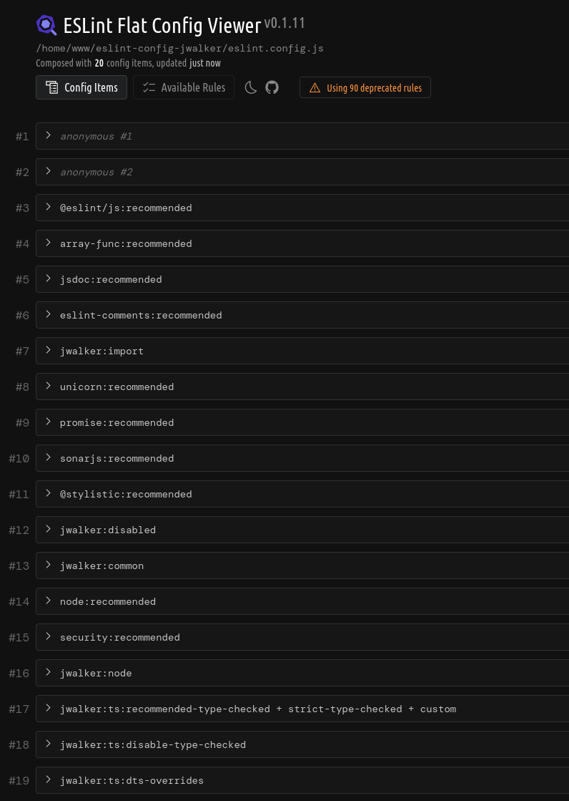

# eslint-config-jwalker

Shareable ESLint config

## Install

```sh
npm i -D eslint-config-jwalker
```

## Usage

```javascript
import { common, typescript, node } from 'eslint-config-jwalker'

/** @type {import('eslint').Linter.FlatConfig[]} */
export default [
    ...common,
    ...node,
    ...typescript,
    {
        rules: {
            // override?
            'import/extensions': 'off',
        },
    },
]
```

## Presets + Custom Rules


